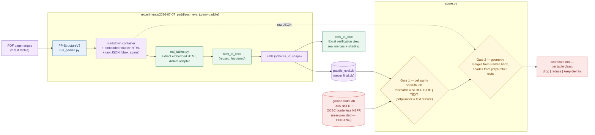
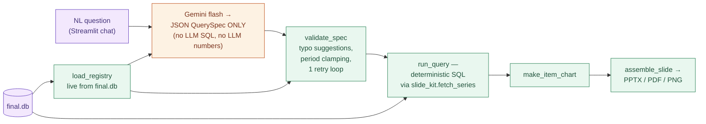

# findociq — workflow diagrams

n8n-style node/flow views of the pipeline, for documentation. Source of truth is the
mermaid blocks below — they render natively on GitHub and in VS Code markdown preview
(⇧⌘V, with the built-in mermaid support or the "Markdown Preview Mermaid" extension).
Rendered SVGs (if present) live next to this file.

Update rule (CLAUDE.md): any routing decision-tree pivot must be reflected HERE and in
the routing spec, and called out to the user — diagrams that drift from the router are
worse than no diagrams.

---

## 1. Production pipeline (current architecture)

Zero-LLM discovery → deterministic routing → Gemini extraction → single load → verify → stamp.
(MinerU was DROPPED 2026-07-02: discovery = PASS1_TOC port, deterministic pdfplumber printed
TOC; routing = coverage-gated scan.py v2.)

```mermaid
flowchart LR
    classDef offline fill:#e8f1fb,stroke:#2b6cb0,color:#1a365d
    classDef llm fill:#fdf2e3,stroke:#c05621,color:#7b341e
    classDef code fill:#e9f7ef,stroke:#2f855a,color:#22543d
    classDef store fill:#f3e8fd,stroke:#6b46c1,color:#44337a
    classDef human fill:#fde8e8,stroke:#c53030,color:#742a2a

    PDF["Source PDF<br/>data/sources/"]:::store

    subgraph S1["Stage 1 — Discovery (offline, zero LLM)"]
        TOC["pass1_toc.py<br/>deterministic pdfplumber<br/>printed-TOC parse"]:::offline
        MANIFEST["sections + page ranges<br/>(text-only sections → skip)"]:::code
    end

    subgraph RT["Routing — scan.py v2 (pure code, deterministic)"]
        NUMCOV["num_cov classifier<br/>numeric tokens inside ruled<br/>fragments (HI .80 / LO .50)"]:::code
        CLASSES["page class:<br/>BORDERED_SINGLE |<br/>BORDERLESS_MAIN |<br/>MIXED_REVIEW<br/>(decoys → dropped_fragments)"]:::code
        TMATCH["per-unit template match<br/>title keywords + ≥60%<br/>col-header hits vs template_col"]:::code
        AUTH["structure authority:<br/>ruled → merge_map.py (rects)<br/>borderless → template_cell"]:::code
        PROMPT["prompt selection<br/>pipeline/prompts/"]:::code
        ROUTEMAP["route/out/*_route_v2.json<br/>+ route_map.html<br/>(visible branch-per-page)"]:::store
    end

    subgraph S2["Stage 2 — Extraction (LLM)"]
        GEMINI["extract_run.py —<br/>Gemini 3.5-flash per unit,<br/>fail-loudly; --from-html =<br/>zero-token replay"]:::llm
    end

    subgraph S3["Stage 3 — Load once"]
        PARSE["html_to_cells<br/>HTML → schema_v5 cells"]:::code
        LOAD["load: section + table_t<br/>+ cells together"]:::code
    end

    subgraph POST["Post-load"]
        VERIFY["verification gate<br/>verify_cells"]:::code
        STAMP["stamp.py → concept_key /<br/>col_key, band-skip"]:::code
        DRIFT["drift-CSV → review_queue"]:::human
    end

    FINAL[("final.db")]:::store

    subgraph OUT["Consumers"]
        CHAT["chat-with-data app<br/>(Streamlit)"]:::code
        SLIDES["NSFR slides / PPTX"]:::code
        TS["cross-bank time series"]:::code
    end

    PDF --> TOC --> MANIFEST --> NUMCOV --> CLASSES --> TMATCH --> AUTH --> PROMPT --> GEMINI
    CLASSES -.-> ROUTEMAP
    TMATCH -.-> ROUTEMAP
    GEMINI --> PARSE --> LOAD --> VERIFY --> STAMP --> FINAL
    STAMP -.-> DRIFT
    FINAL --> CHAT & SLIDES & TS
```

The one manual step still tolerated (template authoring: official notice → registry seed
→ aliases) feeds the template registry; everything else above is code-decided.

---

## 2. PaddleOCR Stage-2 spike (design in progress, 2026-07-07)

Question: can PP-StructureV3 geometry replace/reduce Gemini in Stage 2?
Corpus (revised): **2 tests — DBS NSFR, OCBC borderless NSFR**. Ground truth = correct
final output **.db samples provided by the user** (NOT the Gemini 3.5 HTML — known
incorrect for NSFR). Verdict per table class: drop / reduce / keep Gemini.

Reading the spike diagram: markdown is the human-readable container, the embedded HTML
tables are the structural payload, and the Excel view is generated FROM the parsed cells
— so what you inspect in Excel is byte-for-byte what the DB received.

---

## 3. Chat-with-data demo (shipped 2026-07-06, for reference)

---

## 4. Section→table tagging (routing branch, 2026-07-09)

Every detected table is tagged to its most granular (LEAF) section — the input contract
for routed Stage-2 prompts. Two-step principle (spec 2026-07-09 + amendment): an LLM may
VALIDATE headings (semantics), but only CODE assigns tables (position). Branch keyed on
printed-TOC presence; both branches converge on one deterministic assigner.
Wiring into scan.py's route manifest = next pivot (not yet done).

```mermaid
flowchart LR
    classDef offline fill:#e8f1fb,stroke:#2b6cb0,color:#1a365d
    classDef llm fill:#fdf2e3,stroke:#c05621,color:#7b341e
    classDef code fill:#e9f7ef,stroke:#2f855a,color:#22543d
    classDef store fill:#f3e8fd,stroke:#6b46c1,color:#44337a

    PDF["Source PDF"]:::store --> EMIT

    subgraph EMIT["candidates.py v2 — .venv-paddle · Paddle proposes, never decides"]
        LAYOUT["PP-DocLayout-L<br/>paragraph_title + table boxes<br/>(~2s/page, geometry only)"]:::offline
        TYPO["typographic fallback<br/>font ≥1.3× page body<br/>(catches 20pt statement titles)"]:::code
        CLEAN["running-header filter (≥3 pages)<br/>+ spaced/glued twin dedup"]:::code
        LAYOUT --> TYPO --> CLEAN
    end

    EMIT --> CAND["candidates.csv<br/>page,y0,x0,text,size,bold,align,is_dateish"]:::store
    EMIT --> REG["regions.csv<br/>page,table_idx,bbox (pt)"]:::store

    CAND --> DENS{"printed TOC?<br/>(tag_sections.py pick_branch)"}:::code

    DENS -- "yes → deterministic, $0" --> TOCV["toc_match.py v2<br/>candidates × printed toc.json<br/>fuzzy ≥0.9, deepest id wins<br/>date lines die: not TOC members"]:::code
    DENS -- "no → ONE small LLM call" --> GEMV["sections_from_gemini.py<br/>INDEXED candidates only, no tables<br/>returns sections + candidate_idxs<br/>never positions, never assignments"]:::llm

    TOCV --> BOUND["boundaries<br/>{section_id, level, page, y0, continued}"]:::store
    GEMV --> BOUND

    BOUND --> ASSIGN["assign_tables.py — SHARED, deterministic<br/>reading-order cursor = deepest heading above<br/>'(continued)' ancestor banner cannot steal<br/>a still-continuing subsection"]:::code
    REG --> ASSIGN

    ASSIGN --> MAN["section_manifest.csv<br/>doc_id,page,LEAF section_id,title,<br/>table_idx,bbox,template_type,prompt,source"]:::store
    MAN --> MAP["section_map.csv / .html<br/>leaf sections · start_page/end_page · n_tables"]:::store
    MAN --> EXT["Stage-2 extraction (later)<br/>crop page+bbox → routed prompt per section"]:::llm
```

Provenance per artifact: regions/candidates = PP-DocLayout-L (+pdfplumber text; no OCR);
section_tags = printed_toc | gemini (visible in `source` column); manifest/map = pure code.
Acceptance (2026-07-09): FS p13→2.8, p30→2.21.3 (never bare "2"); P3 zero bare-parent tags;
GT: P3 36/38 sections, FS 45/45 (scorer v2 rolls granular ids up to note-level GT).
