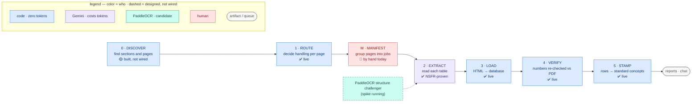
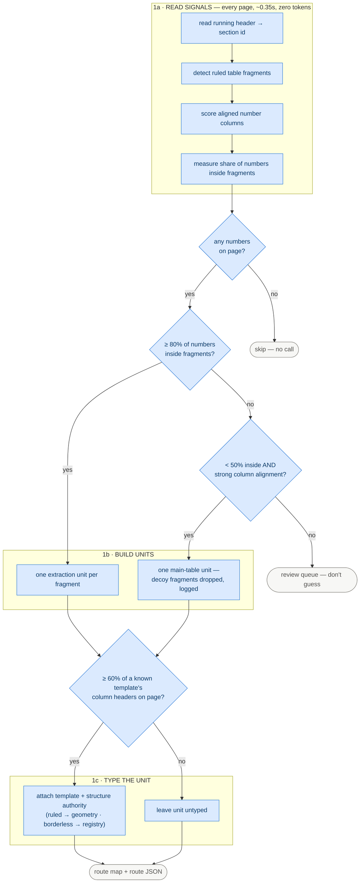
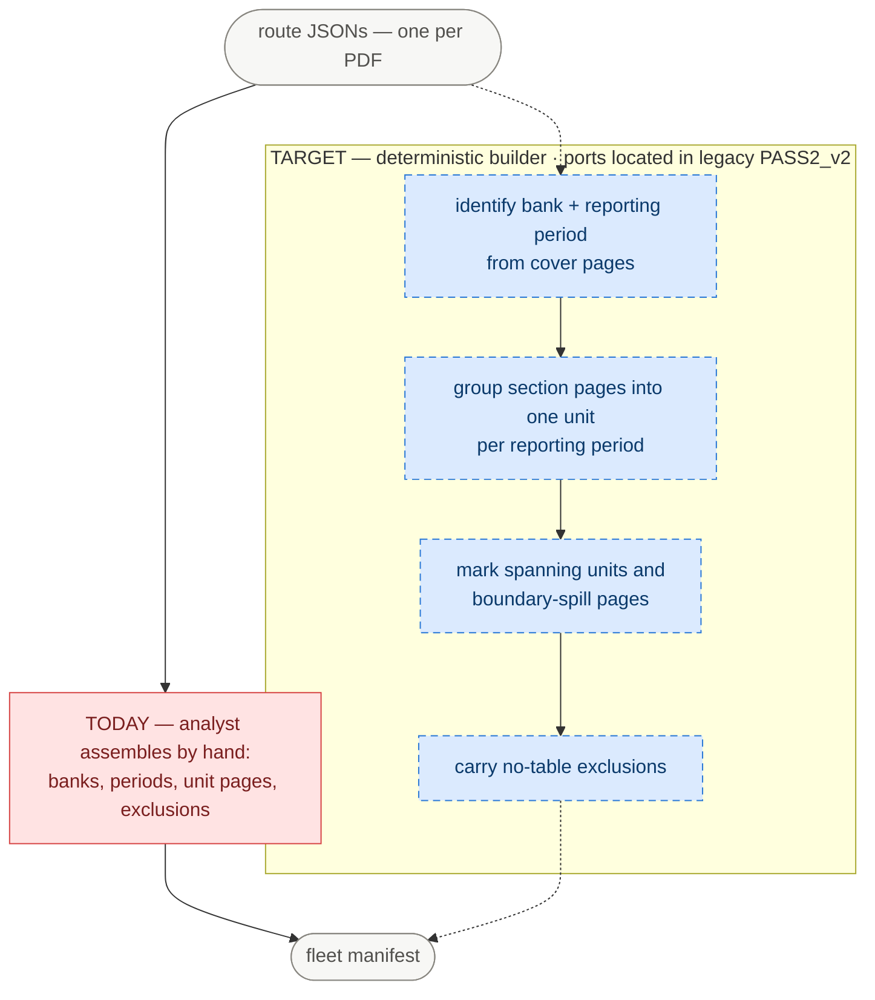
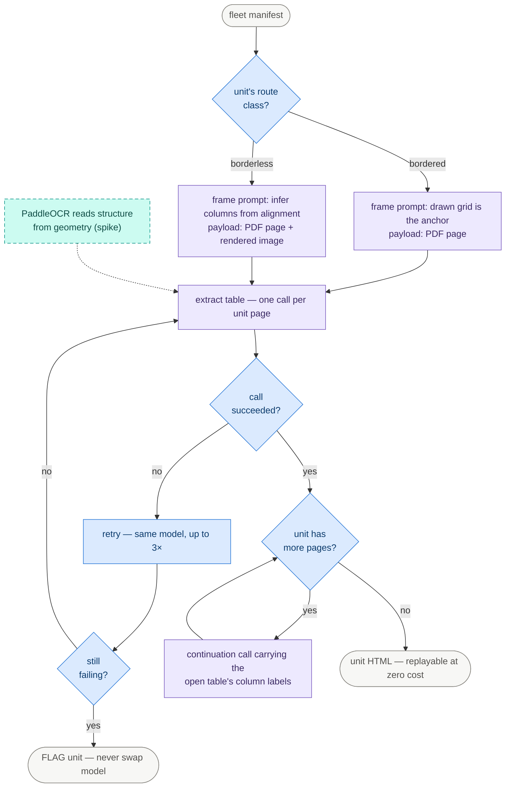
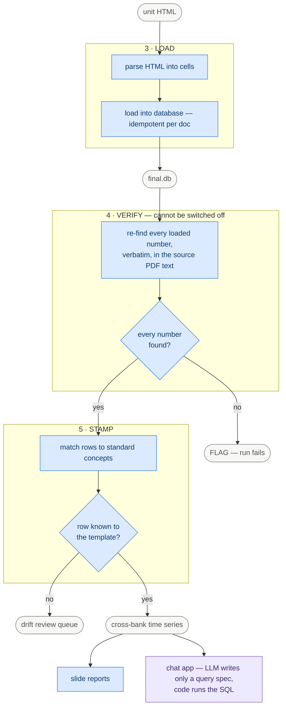
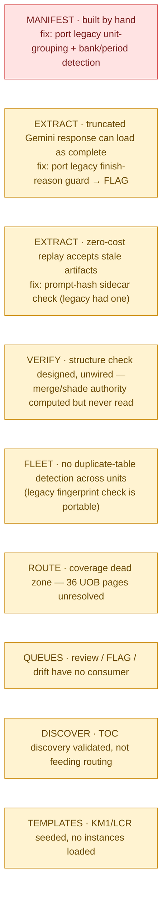

# Pipeline — management view (2026-07-08)

Visual grammar (consistent across all diagrams):

- **Rectangle** = task (verb phrase). **Diamond** = decision (condition only). **Stadium** = artifact/queue.
- **Color = who does it**: blue = deterministic code (zero tokens) · purple = Gemini (costs tokens) · teal = PaddleOCR (candidate) · red = human/manual.
- **Dashed border** = designed but not wired yet.
- Status: ✅ live · 🟡 partial · 🔴 missing/manual.

Rendered PNGs sit beside this file (`2026-07-08-mgmt-*.png`). Re-render via the mermaid MCP after edits.

## 0 — Executive overview

## 1 — ROUTE (detail)

## M — MANIFEST BUILDER (today vs target)

## 2 — EXTRACT (detail)

## 3/4/5 — LOAD · VERIFY · STAMP (detail)

## G — Open gaps panel

